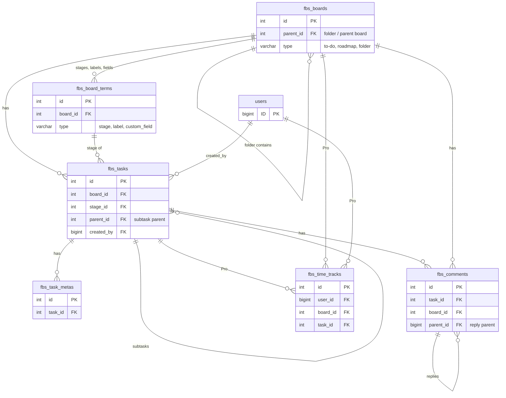
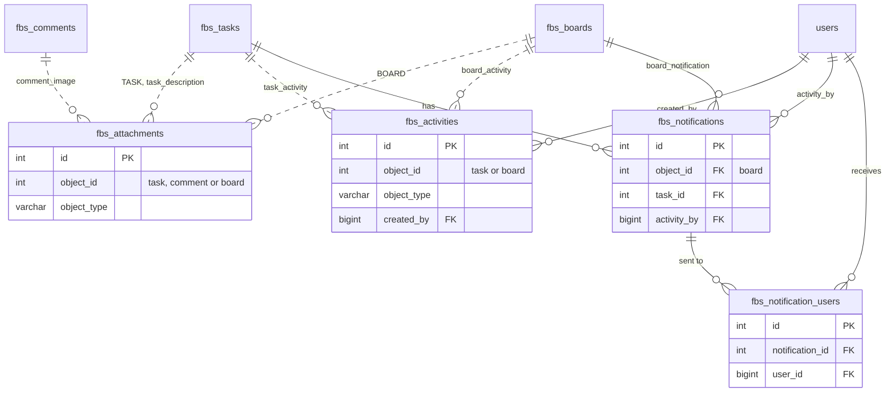
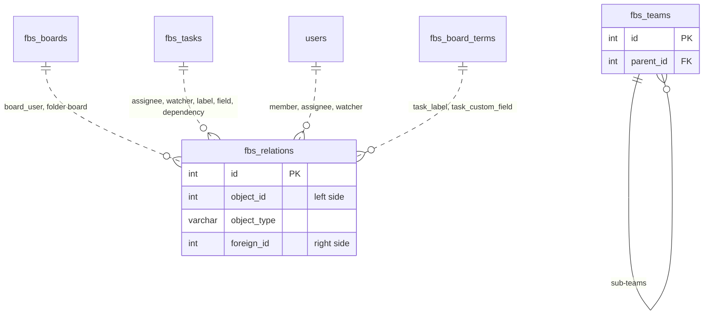

# FluentBoards Database Schema

<Badge type="tip" vertical="top" text="FluentBoards Core" /> <Badge type="warning" vertical="top" text="Advanced" />

FluentBoards stores its data in custom database tables. This page lists every table with its columns, types, defaults and indexes, taken from the migration files.

- Free tables are created by the migrators in `fluent-boards/database/Migrations/` (run by `database/DBMigrator.php`).
- The only Pro table, `fbs_time_tracks`, is created by `fluent-boards-pro/app/Modules/TimeTracking/TimerInit.php` when the Time Tracking module is enabled.

All table names get the WordPress table prefix. With the default prefix, `fbs_boards` becomes `wp_fbs_boards`. The query builder and the models add the prefix for you, so in PHP you always write `fbs_boards`.

::: tip Conventions
- Every table has an `INT UNSIGNED AUTO_INCREMENT` primary key named `id`.
- Columns marked "serialized" are stored with `maybe_serialize()`. The matching model unserializes them for you.
- `created_at` / `updated_at` are `TIMESTAMP NULL` and are managed by the models.
:::

## Tables at a Glance

| Table | Model(s) | Stores | Edition |
|---|---|---|---|
| [fbs_boards](#fbs-boards-table) | [Board](/database/models/board), [Folder](/database/models/folder) | Boards (`type` `to-do` / `roadmap`) and folders (`type` `folder`) | Free |
| [fbs_board_terms](#fbs-board-terms-table) | [BoardTerm](/database/models/board-term), [Stage](/database/models/stage), [Label](/database/models/label), [CustomField](/database/models/custom-field) | Stages, labels and custom field definitions | Free |
| [fbs_tasks](#fbs-tasks-table) | [Task](/database/models/task) | Tasks and subtasks | Free |
| [fbs_task_metas](#fbs-task-metas-table) | [TaskMeta](/database/models/task-meta) | Key/value meta for tasks | Free |
| [fbs_attachments](#fbs-attachments-table) | [Attachment](/database/models/attachment), [TaskImage](/database/models/task-image), [CommentImage](/database/models/comment-image), [TaskAttachment](/database/models/task-attachment) | Files and links attached to tasks, comments and boards | Free |
| [fbs_comments](#fbs-comments-table) | [Comment](/database/models/comment) | Task comments and replies | Free |
| [fbs_activities](#fbs-activities-table) | [Activity](/database/models/activity) | Board and task activity log | Free |
| [fbs_notifications](#fbs-notifications-table) | [Notification](/database/models/notification) | In-app notifications | Free |
| [fbs_notification_users](#fbs-notification-users-table) | [NotificationUser](/database/models/notification-user) | Notification recipients and read state | Free |
| [fbs_teams](#fbs-teams-table) | [Team](/database/models/team) | Teams | Free |
| [fbs_metas](#fbs-metas-table) | [Meta](/database/models/meta), [Webhook](/database/models/webhook) | Generic meta: options, board meta, webhooks, repeat-task settings | Free |
| [fbs_relations](#fbs-relations-table) | [Relation](/database/models/relation) | Many-to-many links (board members, assignees, labels, watchers, ...) | Free |
| [fbs_time_tracks](#fbs-time-tracks-table) | [TimeTrack](/database/models/time-track) | Time tracking entries | Pro |
| [users](#users-table) | [User](/database/models/user) | WordPress core users table (not created by FluentBoards) | WordPress |

## Entity Relationship Diagrams

The schema is split into three diagrams. Solid lines are real ID columns. Dashed lines go through `object_id` + `object_type` (polymorphic) or through `fbs_relations` rows, so the database does not enforce them. `fbs_metas` is left out because what it points to depends on `object_type`.

### Boards, Stages and Tasks

### Attachments, Activities and Notifications

### Relations (`fbs_relations`) and Teams

Each line is one `object_type` value. See [fbs_relations](#fbs-relations-table) for the full list.

## Relationships Summary

How the tables connect. "Pivot" rows live in `fbs_relations`, filtered by `object_type`.

| From | Column(s) | To | Kind |
|---|---|---|---|
| `fbs_board_terms` | `board_id` | `fbs_boards.id` | many-to-one |
| `fbs_tasks` | `board_id` | `fbs_boards.id` | many-to-one |
| `fbs_tasks` | `stage_id` | `fbs_board_terms.id` (`type = 'stage'`) | many-to-one |
| `fbs_tasks` | `parent_id` | `fbs_tasks.id` (subtasks) | many-to-one |
| `fbs_tasks` | `created_by` | `users.ID` | many-to-one |
| `fbs_tasks` | `crm_contact_id` | FluentCRM `fc_subscribers.id` | many-to-one (optional) |
| `fbs_task_metas` | `task_id` | `fbs_tasks.id` | many-to-one |
| `fbs_comments` | `task_id`, `board_id` | `fbs_tasks.id`, `fbs_boards.id` | many-to-one |
| `fbs_comments` | `parent_id` | `fbs_comments.id` (replies) | many-to-one |
| `fbs_attachments` | `object_id` + `object_type` | `fbs_tasks.id` (`TASK`, `task_description`), `fbs_comments.id` (`comment_image`), `fbs_boards.id` (`BOARD`) | polymorphic |
| `fbs_activities` | `object_id` + `object_type` | `fbs_tasks.id` (`task_activity`), `fbs_boards.id` (`board_activity`) | polymorphic |
| `fbs_activities` | `created_by` | `users.ID` | many-to-one |
| `fbs_notifications` | `object_id` (`object_type = 'board_notification'`) | `fbs_boards.id` | many-to-one |
| `fbs_notifications` | `task_id`, `activity_by` | `fbs_tasks.id`, `users.ID` | many-to-one |
| `fbs_notification_users` | `notification_id`, `user_id` | `fbs_notifications.id`, `users.ID` | pivot |
| `fbs_metas` | `object_id` + `object_type` | depends on `object_type` (see [fbs_metas](#fbs-metas-table)) | polymorphic |
| `fbs_relations` | `object_id`, `foreign_id` + `object_type` | depends on `object_type` (see [fbs_relations](#fbs-relations-table)) | pivot |
| `fbs_teams` | `parent_id` | `fbs_teams.id` | many-to-one |
| `fbs_time_tracks` | `user_id`, `board_id`, `task_id` | `users.ID`, `fbs_boards.id`, `fbs_tasks.id` | many-to-one (Pro) |

## fbs_boards Table

Stores boards. The same table also stores **folders**: rows with `type = 'folder'`, read through the [Folder](/database/models/folder) model.

| Column | Type | Null / Default | Comment |
|---|---|---|---|
| id | INT UNSIGNED | AUTO_INCREMENT | Primary key |
| parent_id | INT UNSIGNED | NULL | Parent board or folder (for nesting) |
| title | TEXT | NULL | Board title, may be longer than 255 characters |
| description | LONGTEXT | NULL | Board description |
| type | VARCHAR(50) | NULL | `to-do` (default set by the model), `roadmap`, or `folder` |
| currency | VARCHAR(50) | NULL | Currency code |
| background | TEXT | NULL | Serialized background settings |
| settings | TEXT | NULL | Serialized board settings. Templates have `is_template = true` |
| created_by | INT UNSIGNED | NOT NULL | WP user ID of the creator |
| archived_at | TIMESTAMP | NULL | Set when the board is archived |
| created_at | TIMESTAMP | NULL | |
| updated_at | TIMESTAMP | NULL | |

**Indexes:** `parent_id`, `type`

## fbs_board_terms Table

Stores the per-board "terms": stages, labels, and custom field definitions. The `type` column tells them apart.

| Column | Type | Null / Default | Comment |
|---|---|---|---|
| id | INT UNSIGNED | AUTO_INCREMENT | Primary key |
| board_id | INT UNSIGNED | NOT NULL | Owning board |
| title | VARCHAR(100) | NULL | Title. A label may have only a color and no title |
| slug | VARCHAR(100) | NULL | Slug |
| type | VARCHAR(50) | NOT NULL, DEFAULT `'stage'` | `stage`, `label`, or `custom-field` |
| position | DECIMAL(10,2) | NOT NULL, DEFAULT `1` | Sort position (1 = first). Older installs are upgraded from INT to DECIMAL by the migrator |
| color | VARCHAR(50) | NULL | Text color |
| bg_color | VARCHAR(50) | NULL | Background color |
| settings | TEXT | NULL | Serialized settings. Stages default to `default_task_status` and `is_template` |
| archived_at | TIMESTAMP | NULL | Set when the term is archived |
| created_at | TIMESTAMP | NULL | |
| updated_at | TIMESTAMP | NULL | |

**Indexes:** `title`, `type`, `position`, `slug`

## fbs_tasks Table

Stores tasks. Subtasks are rows in the same table with `parent_id` set.

| Column | Type | Null / Default | Comment |
|---|---|---|---|
| id | INT UNSIGNED | AUTO_INCREMENT | Primary key |
| parent_id | INT UNSIGNED | NULL | Parent task ID when the row is a subtask |
| board_id | INT UNSIGNED | NULL | Board the task belongs to |
| crm_contact_id | BIGINT UNSIGNED | NULL | Linked contact, for example a FluentCRM subscriber ID |
| title | TEXT | NULL | Task title, may be longer than 255 characters |
| slug | VARCHAR(255) | NULL | Slug, generated from the title when empty |
| type | VARCHAR(50) | NULL | `task` or `roadmap`. Set by the model from the board type |
| status | VARCHAR(50) | NULL, DEFAULT `'open'` | `open` or `closed` |
| stage_id | INT UNSIGNED | NULL | Stage (`fbs_board_terms.id`) |
| source | VARCHAR(50) | NULL, DEFAULT `'web'` | Where the task came from, for example `web`, `funnel`, `contact-section` |
| source_id | VARCHAR(255) | NULL | ID in the source system. Older installs are upgraded from INT by the migrator |
| priority | VARCHAR(50) | NULL, DEFAULT NULL | `urgent`, `high`, `medium`, `low`, or empty for no priority |
| description | LONGTEXT | NULL | Task description (HTML) |
| lead_value | DECIMAL(10,2) | DEFAULT `0.00` | Value for pipeline-style boards |
| created_by | BIGINT UNSIGNED | NULL | WP user ID of the creator |
| position | DECIMAL(10,2) | NOT NULL, DEFAULT `1` | Sort position inside the stage, or inside the parent for subtasks |
| comments_count | INT UNSIGNED | NULL, DEFAULT `0` | Cached count of top-level comments |
| issue_number | INT UNSIGNED | NULL | Board-specific issue number |
| reminder_type | VARCHAR(100) | NULL, DEFAULT `'none'` | Reminder type |
| settings | TEXT | NULL | Serialized settings (`cover`, `subtask_count`, `subtask_completed_count`, `attachment_count`, ...) |
| remind_at | TIMESTAMP | NULL | Reminder time |
| started_at | TIMESTAMP | NULL | Start date |
| due_at | TIMESTAMP | NULL | Due date |
| last_completed_at | TIMESTAMP | NULL | Set when the task is closed, cleared when it is reopened |
| archived_at | TIMESTAMP | NULL | Set when the task is archived |
| created_at | TIMESTAMP | NULL | |
| updated_at | TIMESTAMP | NULL | |

**Indexes:** `type`, `board_id`, `slug`, `comments_count`, `issue_number`, `crm_contact_id`, `due_at`, `priority`

## fbs_task_metas Table

Key/value meta for tasks. Keys used by the plugin include `is_pinned`, `subtask_group_id`, `group_name` and `upvote`.

| Column | Type | Null / Default | Comment |
|---|---|---|---|
| id | INT UNSIGNED | AUTO_INCREMENT | Primary key |
| task_id | INT UNSIGNED | NOT NULL | Task ID |
| key | VARCHAR(100) | NOT NULL | Meta key |
| value | LONGTEXT | NULL | Meta value (serialized by the model when needed) |
| created_at | TIMESTAMP | NULL | |
| updated_at | TIMESTAMP | NULL | |

**Indexes:** `task_id`

## fbs_attachments Table

Files and links attached to tasks, task descriptions, comments and boards.

| Column | Type | Null / Default | Comment |
|---|---|---|---|
| id | INT UNSIGNED | AUTO_INCREMENT | Primary key |
| object_id | INT UNSIGNED | NOT NULL | Task, comment or board ID |
| object_type | VARCHAR(100) | DEFAULT `'TASK'` | `TASK` (task attachment), `task_description` (image in a task description), `comment_image`, `BOARD` |
| attachment_type | VARCHAR(100) | NULL | For example `url` for a link, or the file type for uploads |
| file_path | TEXT | NULL | Local file path |
| full_url | TEXT | NULL | Public or remote URL |
| settings | TEXT | NULL | Serialized settings |
| title | VARCHAR(192) | NULL | Display title |
| file_hash | VARCHAR(192) | NULL | Random hash used in secure download URLs |
| driver | VARCHAR(100) | DEFAULT `'local'` | Storage driver (`local`, or a Pro cloud storage driver) |
| status | VARCHAR(100) | NULL, DEFAULT `'ACTIVE'` | `ACTIVE`, `INACTIVE` or `DELETED` |
| file_size | VARCHAR(100) | NULL | File size |
| created_at | TIMESTAMP | NULL | |
| updated_at | TIMESTAMP | NULL | |

**Indexes:** `object_type`, `object_id`, `attachment_type`, `status`, `file_hash`, `driver`

## fbs_comments Table

Comments and replies on tasks.

| Column | Type | Null / Default | Comment |
|---|---|---|---|
| id | INT UNSIGNED | AUTO_INCREMENT | Primary key |
| board_id | INT UNSIGNED | NOT NULL | Board ID |
| task_id | INT UNSIGNED | NOT NULL | Task ID |
| parent_id | BIGINT UNSIGNED | NULL | Parent comment ID for replies |
| type | VARCHAR(50) | NULL, DEFAULT `'comment'` | `comment`, `note` or `reply` |
| privacy | VARCHAR(50) | NULL, DEFAULT `'public'` | `public` or `private`. The model sets `private` when empty |
| status | VARCHAR(50) | NULL, DEFAULT `'published'` | `published`, `draft` or `spam` |
| author_name | VARCHAR(192) | NULL, DEFAULT `''` | Author name (filled from the WP user on create) |
| author_email | VARCHAR(192) | NULL, DEFAULT `''` | Author email (filled from the WP user on create) |
| author_ip | VARCHAR(50) | NULL, DEFAULT `''` | Author IP |
| description | TEXT | NULL | Comment body (HTML) |
| created_by | BIGINT UNSIGNED | NULL | WP user ID of the author |
| settings | TEXT | NULL | Serialized settings |
| created_at | TIMESTAMP | NULL | |
| updated_at | TIMESTAMP | NULL | |

**Indexes:** `type`, `task_id`, `board_id`, `status`, `privacy`

## fbs_activities Table

Activity log for boards and tasks.

| Column | Type | Null / Default | Comment |
|---|---|---|---|
| id | INT UNSIGNED | AUTO_INCREMENT | Primary key |
| object_id | INT UNSIGNED | NOT NULL | Task or board ID |
| object_type | VARCHAR(100) | NOT NULL | `task_activity` or `board_activity` |
| action | VARCHAR(50) | NOT NULL | For example `created`, `updated`, `added`, `changed`, `removed`, `deleted` |
| column | VARCHAR(50) | NULL | Changed field |
| old_value | VARCHAR(50) | NULL | Value before the change |
| new_value | VARCHAR(50) | NULL | Value after the change |
| description | LONGTEXT | NULL | Description of the change |
| created_by | BIGINT UNSIGNED | NULL | WP user ID that made the change |
| settings | TEXT | NULL | Serialized settings |
| created_at | TIMESTAMP | NULL | |
| updated_at | TIMESTAMP | NULL | |

**Indexes:** `object_type`, `object_id`

## fbs_notifications Table

In-app notifications. Recipients are stored in [fbs_notification_users](#fbs-notification-users-table).

| Column | Type | Null / Default | Comment |
|---|---|---|---|
| id | INT UNSIGNED | AUTO_INCREMENT | Primary key |
| object_id | INT UNSIGNED | NOT NULL | Board ID |
| object_type | VARCHAR(100) | NOT NULL | `board_notification` |
| task_id | INT UNSIGNED | NULL | Related task |
| action | VARCHAR(255) | NULL | Hook-like action name, for example `task_created`, `task_comment_mentioned` |
| activity_by | BIGINT UNSIGNED | NOT NULL | WP user ID that triggered the notification |
| description | LONGTEXT | NULL | Notification text |
| settings | TEXT | NULL | Serialized settings |
| created_at | TIMESTAMP | NULL | |
| updated_at | TIMESTAMP | NULL | |

**Indexes:** `object_id`, `object_type`, `activity_by`

## fbs_notification_users Table

Links notifications to the users who receive them and tracks read state.

| Column | Type | Null / Default | Comment |
|---|---|---|---|
| id | INT UNSIGNED | AUTO_INCREMENT | Primary key |
| notification_id | INT UNSIGNED | NULL | Notification ID |
| user_id | BIGINT UNSIGNED | NOT NULL | Recipient WP user ID |
| marked_read_at | TIMESTAMP | NULL | When the user read it. NULL means unread |
| created_at | TIMESTAMP | NULL | |
| updated_at | TIMESTAMP | NULL | |

**Indexes:** `notification_id`, `user_id`

## fbs_teams Table

| Column | Type | Null / Default | Comment |
|---|---|---|---|
| id | INT UNSIGNED | AUTO_INCREMENT | Primary key |
| parent_id | INT UNSIGNED | NULL | Parent team |
| title | VARCHAR(100) | NOT NULL | Team name |
| description | TEXT | NULL | Description |
| type | VARCHAR(50) | NOT NULL | Team type |
| visibility | VARCHAR(50) | DEFAULT `'VISIBLE'` | `VISIBLE` or `SECRET` |
| notifications_enabled | TINYINT(1) | DEFAULT `1` | Whether notifications are on |
| settings | TEXT | NULL | Serialized settings |
| created_by | BIGINT UNSIGNED | NOT NULL | WP user ID of the creator |
| created_at | TIMESTAMP | NULL | |
| updated_at | TIMESTAMP | NULL | |

**Indexes:** `type`, `visibility`, `created_by`, `parent_id`, `notifications_enabled`, `title`

## fbs_metas Table

Generic key/value storage. `object_type` says what `object_id` points to.

| Column | Type | Null / Default | Comment |
|---|---|---|---|
| id | INT UNSIGNED | AUTO_INCREMENT | Primary key |
| object_id | INT UNSIGNED | NULL | Related object ID (NULL for global options) |
| object_type | VARCHAR(100) | NOT NULL | See the list below |
| key | VARCHAR(100) | NULL | Meta key |
| value | LONGTEXT | NULL | Meta value (serialized by the model) |
| created_at | TIMESTAMP | NULL | |
| updated_at | TIMESTAMP | NULL | |

**Indexes:** `object_id`

Common `object_type` values:

| object_type | object_id | Used for |
|---|---|---|
| `option` | — | Plugin options read by `fluent_boards_get_option()` / `fluent_boards_update_option()` |
| `board` | Board ID | Board meta (`Board::getMeta()`, `Board::updateMeta()`) |
| `user` | WP user ID | Per-user settings, for example global notification preferences |
| `webhook` | — | Incoming webhooks ([Webhook](/database/models/webhook) model) |
| `outgoing_webhook` | — | Outgoing webhooks |
| `repeat_task` | Task ID | Repeat (recurring) task settings |
| `fluent_board_admin` | WP user ID | FluentBoards admin flag |

## fbs_relations Table

Generic pivot table behind most many-to-many relations. `object_type` says what the two IDs mean.

| Column | Type | Null / Default | Comment |
|---|---|---|---|
| id | INT UNSIGNED | AUTO_INCREMENT | Primary key |
| object_id | INT UNSIGNED | NOT NULL | Left side of the relation |
| object_type | VARCHAR(100) | NOT NULL | Relation type (see below) |
| foreign_id | INT UNSIGNED | NOT NULL | Right side of the relation |
| settings | TEXT | NULL | Serialized settings |
| preferences | TEXT | NULL | Serialized preferences |
| created_at | TIMESTAMP | NULL | |
| updated_at | TIMESTAMP | NULL | |

**Indexes:** `object_type`, `object_id`, `foreign_id`

`object_type` values (constants in `FluentBoards\App\Services\Constant`):

| object_type | Constant | object_id | foreign_id | Notes |
|---|---|---|---|---|
| `board_user` | `OBJECT_TYPE_BOARD_USER` | Board ID | User ID | Board membership. `settings` holds `is_admin` / `is_viewer_only`, `preferences` holds notification preferences |
| `board_user_email` | `OBJECT_TYPE_BOARD_USER_EMAIL_NOTIFICATION` | Board ID | User ID | Email notification settings |
| `board_user_notification` | `OBJECT_TYPE_BOARD_USER_NOTIFICATION` | Board ID | User ID | Legacy notification settings |
| `task_assignee` | `OBJECT_TYPE_TASK_ASSIGNEE` | Task ID | User ID | Task assignees |
| `task_user_watch` | `OBJECT_TYPE_USER_TASK_WATCH` | Task ID | User ID | Task watchers |
| `task_label` | `OBJECT_TYPE_TASK_LABEL` | Task ID | Label ID | Labels on a task |
| `task_custom_field` | `TASK_CUSTOM_FIELD` | Task ID | Custom field ID | Custom field values (value in `settings`) |
| `task_dependency` | `OBJECT_TYPE_TASK_DEPENDENCY` | Predecessor task ID | Successor task ID | Pro task dependencies |
| `outgoing_webhook_board` | — | Outgoing webhook ID (`fbs_metas.id`) | Board ID | Boards an outgoing webhook listens to. `settings` holds the triggered events |
| `FluentBoardsPro\App\Models\Folder` | `OBJECT_TYPE_FOLDER_BOARD` | Folder ID | Board ID | Board placed in a folder. The value is a legacy class name string, kept for compatibility |

## fbs_time_tracks Table

<Badge type="warning" text="Pro" />

Time tracking entries. Created by the Pro Time Tracking module the first time the module is enabled (`TimerInit::migrateDbTable()`), not by a migrator class.

| Column | Type | Null / Default | Comment |
|---|---|---|---|
| id | INT UNSIGNED | AUTO_INCREMENT | Primary key |
| user_id | BIGINT UNSIGNED | NOT NULL | WP user ID that tracked the time |
| board_id | INT UNSIGNED | NOT NULL | Board ID |
| task_id | INT UNSIGNED | NOT NULL | Task ID |
| started_at | TIMESTAMP | NULL | Start time |
| completed_at | TIMESTAMP | NULL | End time |
| message | TEXT | NULL | Optional note |
| status | VARCHAR(50) | NULL, DEFAULT `'commited'` | Entries are saved as `commited` (spelled this way in the code). `TimeTrack::getWorkingSeconds()` treats `active` as a running timer |
| working_minutes | INT UNSIGNED | NOT NULL, DEFAULT `0` | Minutes worked |
| billable_minutes | INT UNSIGNED | NOT NULL, DEFAULT `0` | Billable minutes |
| is_manual | TINYINT(1) | NOT NULL, DEFAULT `0` | 1 when the entry was added manually |
| created_at | TIMESTAMP | NULL | |
| updated_at | TIMESTAMP | NULL | |

**Indexes:** `user_id`, `status`, `task_id`, `board_id`

## users Table

The WordPress core `users` table. FluentBoards reads it through the [User](/database/models/user) model and does not change its schema.

| Column | Type | Comment |
|---|---|---|
| ID | BIGINT UNSIGNED | Primary key |
| user_login | VARCHAR(60) | Login name |
| user_pass | VARCHAR(255) | Password hash. Never serialized by the User model |
| user_nicename | VARCHAR(50) | URL-friendly name. Hidden by the User model |
| user_email | VARCHAR(100) | Email. Hidden unless the viewer can `list_users` or privileged serialization is on |
| user_url | VARCHAR(100) | Website. Hidden by the User model |
| user_registered | DATETIME | Registration date. Hidden by the User model |
| user_activation_key | VARCHAR(255) | Activation key. Hidden by the User model |
| user_status | INT | Status. Hidden by the User model |
| display_name | VARCHAR(250) | Display name |
